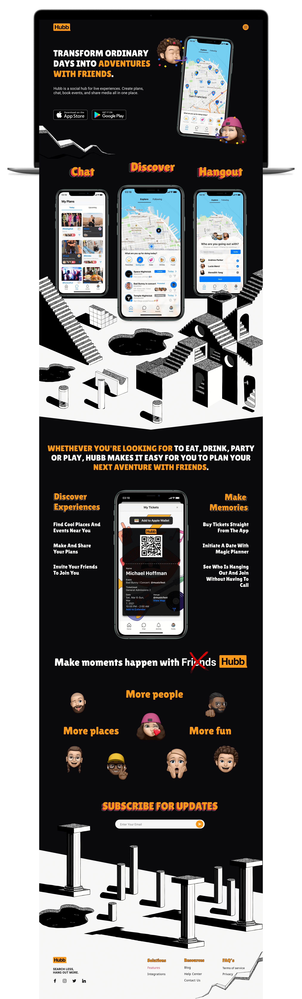

# Hubb Landing Page MVP

[![npm][npm]][npm-url]
[![node][node]][node-url]

This repository contains the Huub's Front-End code to validate the Minimum Viable Product.



> Front-End workflow using Webpack, PUG, SASS, SMACSS-ITCSS, BEM, PostCSS & Babel.

## Installation

Clone the repository to access all project history:

```sh
git clone https://github.com/erwinfriasmtz/hubb-landingpage.git
```

Once the repository was cloned, open directory location from console and install node packages:

```sh
 npm install
```

## Contributors

Erwin Alan Frías Martínez | Product Designer & Front-End Developmet

* [LinkedIn](http://linkedin.com/in/erwinfriasmtz)
* [GitHub](https://github.com/erwinfriasmtz)


### Copyright © General Xplans 2021


[npm]: https://img.shields.io/npm/v/webpack.svg
[npm-url]: https://npmjs.com/package/webpack

[node]: https://img.shields.io/node/v/webpack.svg
[node-url]: https://nodejs.org
